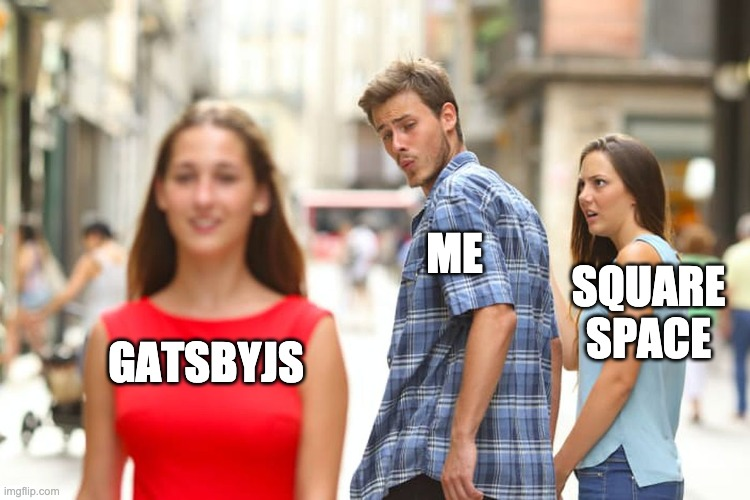
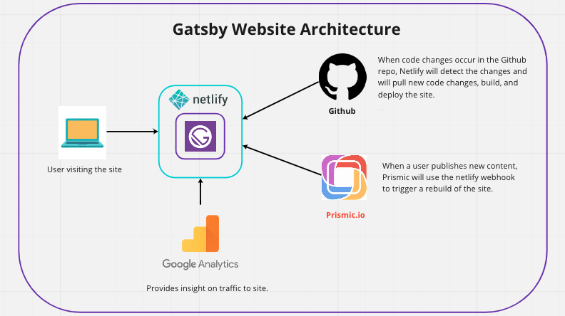
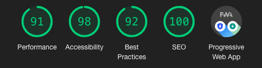

 

 
 

Me and my girlfriend started creating a Photo Bus business and we needed a website. We were first looking at different website builders like Square Space and Wix, but they all charged $10-$30 dollars a month for a simple static website. I convinced her that I could build a fast website with ZERO monthly costs and amazing SEO. Thus, she agreed and I began my journey using GatsbyJS.

Why did I choose GatsbyJS ? This framework was often spoken at my job and on twitter. I would always hear `"fast performance"`, `"great SEO"`, `"beautiful documentation"`, and `"amazing developer experience"`. So many people are saying good things about GatsbyJS, then I figured it must be good. I first decided to read the [GatsbyJS documentation...](https://www.gatsbyjs.org/docs/) and I must say the documentation is `BEAUTIFUL !!!`. 

In one sentence, what is GatsbyJS ? ["Gatsby is a React-based, GraphQL powered, static site generator."](https://www.mediacurrent.com/blog/what-is-gatsbyjs/) (<- click on the link to know more about what GatsbyJS is :) )

I have never used GatsbyJS before this project, but I have lots of experience using ReactJS and GraphQL. I did not want to waste my time throwing spaghetti at the wall, so I decided to take a [Udemy course on GatsbyJS by John Smilga](https://www.udemy.com/share/101ZimAEQYdFlTTHw=/) (I definitely recommend his course).

Once I got a good understanding of how GatsbyJS worked, I began designing the architecture of the site:

 

The idea behind this architecture is:
 * Have quick deployments on code pushes. 
 * Allow my girlfriend to update the content in a CMS (Content Managment System) without needing to touch any code. 
 * Have Goggle Analytics to check usage.
 * Google Lighthouse score must be GOOD.
 * Also, it must be free :)

After a month of iterations on how the website should look, we finally finished !!!

Check out the website: [www.steviethephotobus.com](https://www.steviethephotobus.com/)

Check out the lighthouse scores :)

 

If you want to chat more abour this, then contact me on twitter and I'll gladly explain more! :D
