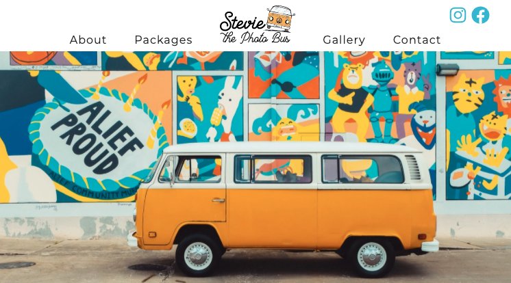

 

 
 

Background, me and my girlfriend started creating a Photo Bus business and we needed a website. We looked at different website builders like 💩`Square Space`💩 and 💩`Wix`💩, but they all charged $10-$20 dollars a month for a simple static website. I convinced my girlfriend that I could build a fast website with ZERO monthly costs and amazing SEO. Thus, she agreed and I began my journey using GatsbyJS.

Why did I choose GatsbyJS ? This framework was often spoken at my job and on twitter. I would always hear `"fast performance"`, `"great SEO"`, `"beautiful documentation"`, and `"amazing developer experience"`. So many people are saying good things about GatsbyJS, then I figured it must be good. I first decided to read the [GatsbyJS documentation...](https://www.gatsbyjs.org/docs/) and I must say the documentation is `BEAUTIFUL !!!`. 

In one sentence, what is GatsbyJS ? ["Gatsby is a React-based, GraphQL powered, static site generator."](https://www.mediacurrent.com/blog/what-is-gatsbyjs/) (<- click on the link to know more about what GatsbyJS is)

I have never used GatsbyJS before this project, but I have lots of experience using ReactJS and GraphQL. I did not want to waste my time throwing spaghetti at the wall, so I decided to take a [Udemy course on GatsbyJS by John Smilga](https://www.udemy.com/share/101ZimAEQYdFlTTHw=/) (I definitely recommend his course).

Once I got a good understanding of how GatsbyJS worked, I began designing the architecture of the site:

 

The idea behind this architecture is:
 * Have quick builds and deployments on code changes. 
 * Have all content managed by CMS (Content Managment System).
 * Have Goggle Analytics to keep track of traffic to the website.
 * Google Lighthouse score must be GOOD.
 * Also, it must be free 😺

After a month of iterations on how the website should look, we finally finished !!!

Check out the website: [www.steviethephotobus.com](https://www.steviethephotobus.com/)

 

What I liked about GatsbyJS:
* Developer experience - The Gatsby CLI is great for building and developing a project. Also, the vast pool of plugins that are configured to work with Gatsby make configurating node packages a breeze. 
* Performance - Any changes you make to a file will take less than a second to show up in the screen. This performance is attributed to Gatsby's Hot Reload feature that is in place by default. However, any plugins that needs to be added and any changes to the gatsby-config.json will require you to restart gatsby.
* Image optimization - Using gatsby-image is one of my favorite tools to use, since it provides different sizes of an image. This is to improve performance on different screen sizes. 
* Lighthouse scores are amazing, check out the lighthouse scores for the website:

 

* Here are a few plugins that I have used:
    * `gatsby-plugin-webpack-bundle-analyser-v2` - Displays a UI that shows you the bundle size in more detail.
    * `gatsby-plugin-sitemap` - Generates sitemap.xml
    * `gatsby-transformer-sharp` and `gatsby-plugin-sharp` - Helps with optimizing images in your page for different screen sizes.
    * `gatsby-plugin-google-analytics` - Allows Google Analytics to capture data regarding visits to your site.
    * `gatsby-plugin-react-helmet` - Gives support for header data to help with SEO.

If you want to chat more about this, then contact me on twitter and I'll gladly explain more! 🙌
